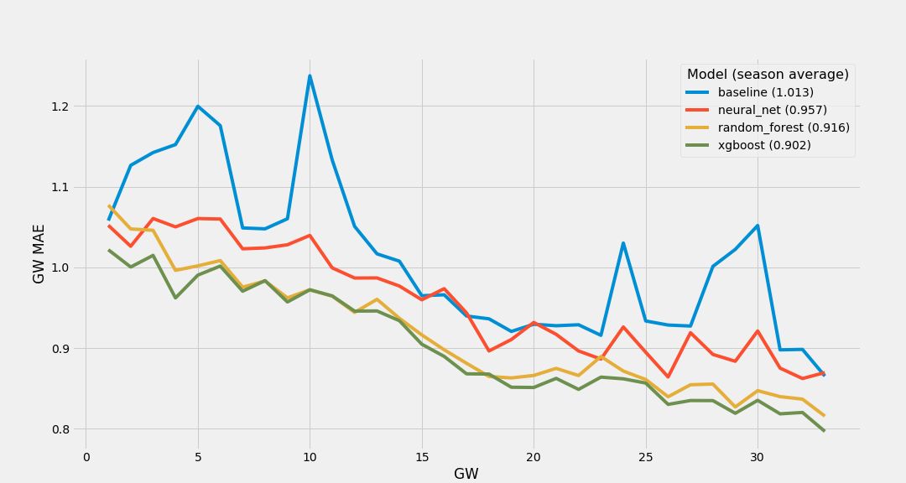

# FPL Prediction
This is a project to generate ongoing player forecasts for Fantasy Premier League. Credit to https://github.com/vaastav/Fantasy-Premier-League, from which I have taken the script to scrape data from the FPL site each week.

The data folder contains the following:
+ Player data for each gameweek since the start of the 2016/17 season (one folder with various csv files for each season)
+ fixtures.csv - Remaining fixtures for the current season
+ teams.csv - Team names and global IDs, plus specific IDs for each season
+ train_v5.csv - The current training dataset containing all historic data
+ remaining_season.csv - A dataset with rows for each player's remaining fixtures in the current season, for use in predicting the remainder of the current season each week

There is a sequence of four notebooks that goes through the entire process taken to train, validate and select the forecast model:
+ 00_fpl_features.ipynb - Explore the training dataset (fields, data types, null values, etc.), write functions to generate window/lagging features (e.g. points per game for each player over the last 5 fixtures), and understand the approach to assessing the performance of models (validation)
+ 01_fpl_predict_baseline.ipynb - Build a simple model to predict players for use as a baseline, and write a function to transform the training data into a format that we can easily use to perform validation
+ 02_fpl_predict_random_forest.ipynb - Build a random forest model and validate its performance
+ 03_fpl_predict_xgboost.ipynb - Build an XGBoost model, including parameter search, and validate its performance
+ 04_fpl_predict_fastai2_tabular.ipynb - Build a neural network model with embeddings for categorical features and validate its performance

These models have been validated by looking at their performance each gameweek of the 2019/20 season. For each gameweek we fit the model using all historical data prior to that week, and then calculate the mean absolute error for the following 6 gameweeks. The performance of each model across the season is summarised in the following chart:



XGBoost is the top performer currently, so this is the approach used to generate forecasts prior to each gameweek.

There are a further three jupyter notebooks:
+ initial_fpl_data_clean.ipynb - The original process to take the raw data and create training and prediction datasets
+ update_data_weekly.ipynb - The notebook run each week to take the raw data and create updated training and prediction datasets
+ fpl_predict_fastai_tabular.ipynb - The notebook fun each week to train a model using all historical data and predict the remainder of the current season

And one supporting python script:
+ helpers.py - various functions used throughout, all of which are described in one of the above process notebooks.

Finally, predictions for all previous gameweeks are provided in the history folder with separate sub-folders for each season.

### Setup:

For the non neural net notebooks I downloaded and installed anaconda and then set up an enivronment with jupyter, xgboost, pandas, matplotlib, requests, lxml and dtreeviz as follows:

```
conda create -n fplenv python=3.7
conda activate fplenv
conda install jupyter py-xgboost pandas matplotlib requests lxml
pip install dtreeviz
```

For neural nets (04_fpl_predict_fastai2_tabular.ipynb) I use fastai/PyTorch (installation instructions at https://docs.fast.ai/#Installing) but I recommend using a cloud instance with a GPU - I currently use Paperspace Gradient which has the option of free GPUs (if available) and has a fastai container available with everything already installed and ready to use.
